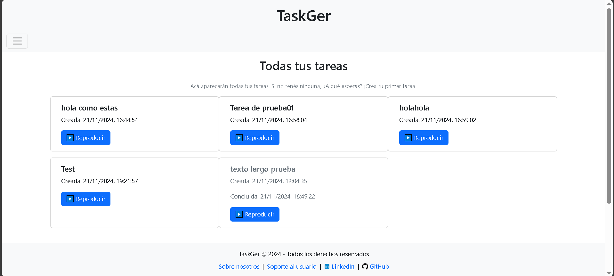
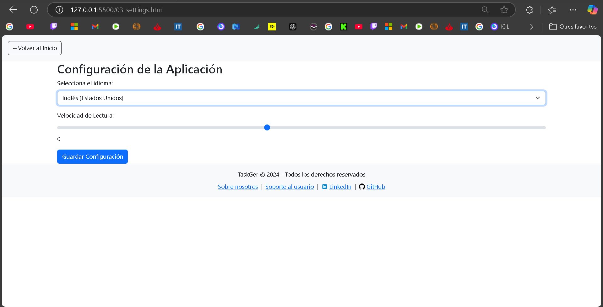
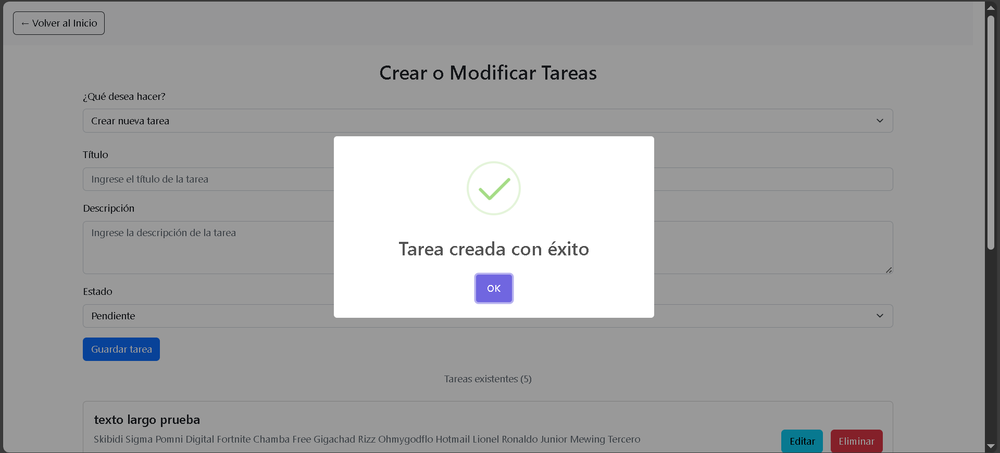

# 📋 TaskGer - Aplicación de Gestión de Tareas

Proyecto realizado por **Leandro Hollmann**  
**Profesor:** Fernando Luna  
**Escuela:** ISTEA  
**Materia:** Aplicaciones Progresivas (PWA)  
**Fecha de Entrega:** 21/11/24 - 18:00hs.

---

## 🎯 ¿Qué es TaskGer?
TaskGer es una aplicación web diseñada para ayudar a los usuarios a gestionar tareas de manera eficiente, con una interfaz moderna, accesible y responsiva.

## 🚀 Características Principales
- Crear, editar y gestionar tareas con facilidad.
- Interfaz responsiva compatible con dispositivos móviles.
- Configuración de accesibilidad con texto a voz y personalización de idioma.
- Alertas estilizadas para notificaciones claras e intuitivas.

### 📄 Tareas (Cards)
- Al iniciar la aplicación, se cargan tareas de ejemplo para facilitar el uso y prueba de sus funcionalidades.
- Permite crear tareas personalizadas, editarlas y eliminarlas según las necesidades del usuario.

---

## 🛠️ Tecnologías y Herramientas Utilizadas

### 🌐 Frontend
- **HTML5**, **CSS3**, **Bootstrap 5**, **JavaScript (ES6)**.

### 📚 Librerías y Recursos
- **SweetAlert2**: Implementada para mostrar alertas estilizadas y amigables al usuario (confirmaciones, mensajes de error, etc).

- **SpeechSynthesis API**: Integrada para convertir texto a voz, permitiendo al usuario reproducir el contenido de las tareas.

### 🌍 Backend y APIs
- **MockAPI**: Implementación de métodos `GET`, `POST`, `PUT` y `DELETE`.
- **LocalStorage**: Almacena configuraciones personalizadas por el usuario, como idioma y velocidad de reproducción.

---

## 🖥️ Capturas de Pantalla

### 1 - Lista de Tareas 📄

### 2 - Configuración de Idioma ⚙️

### 3 - Alertas SweetAlert2 🔔

## 📄 Licencia

Este proyecto está bajo la licencia MIT. Consulta el archivo `LICENSE` para más detalles.

## 🧑 Contribuidores

- **Leandro Hollmann**  
  - [GitHub](https://github.com/leandrohollmann)  
  - [LinkedIn](https://www.linkedin.com/in/leandro-hollmann-b47207306/)